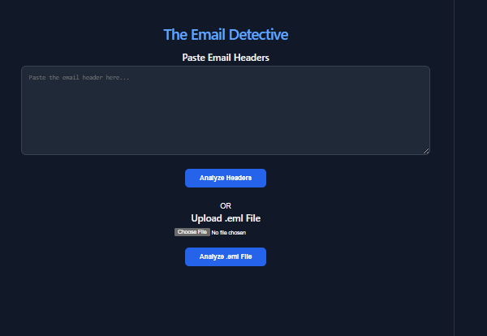
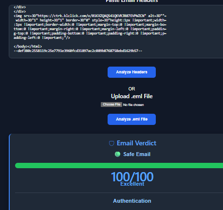
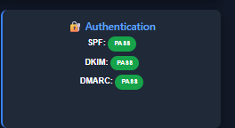
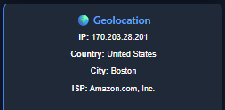
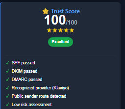

# 🕵️ The Email Detective

> A full-stack email investigation platform built with **FastAPI** and **React** for analyzing email headers, validating email authentication, reconstructing email routes, and generating an overall Trust Score.


---

# 🌐 Live Demo

### 🚀 Application

**Frontend:** https://the-email-detective.vercel.app/

### ⚙️ Backend API

**Render:** https://the-email-detective-api.onrender.com/

### 💻 GitHub Repository

https://github.com/Kamranruzlaan07/The-Email-Detective

---

# 📖 Overview

The Email Detective is a modern full-stack email investigation platform designed for Microsoft 365 administrators, SOC analysts, cybersecurity professionals, and IT support engineers.

The application analyzes raw email headers and uploaded `.eml` files to:

- Verify sender authenticity
- Validate SPF, DKIM, and DMARC authentication
- Detect the sending email provider
- Geolocate sender IP addresses
- Reconstruct email delivery routes
- Assess security risks
- Generate an overall Trust Score (0–100)

This project demonstrates modern full-stack development using **Python**, **FastAPI**, **React**, **REST APIs**, and cloud deployment with **Render** and **Vercel**.

---

# ✨ Features

## 📧 Email Analysis

- Analyze raw email headers
- Upload and inspect `.eml` files
- MIME Subject decoding
- RFC-compliant header parsing

---

## 🔐 Email Authentication

- SPF Validation
- DKIM Validation
- DMARC Validation

---

## 🔍 Email Investigation

- Public IP Detection
- Sender IP Geolocation
- Email Route Reconstruction
- Provider Detection
- Risk Assessment Engine
- Trust Score (0–100)

---

## 📊 Interactive Dashboard

- Email Verdict
- Header Details
- Authentication Results
- Risk Analysis
- Geolocation
- Provider Information
- Trust Score

---

# 📸 Screenshots

## 🏠 Home



---

## 📊 Analysis Dashboard



---

## 🔐 Authentication



---

## 🌍 Geolocation



---

## ⭐ Trust Score



---

# 🏗️ Architecture

```text
                     React + Vite
                           │
                           ▼
                    FastAPI REST API
                           │
        ┌──────────────────┴──────────────────┐
        │                                     │
 Header Parser                        Report Builder
        │
        ├── SPF Checker
        ├── DKIM Checker
        ├── DMARC Checker
        ├── Route Parser
        ├── Geo Locator
        ├── Provider Detector
        ├── IP Validator
        ├── Risk Engine
        └── Trust Engine
```

---

# 🛠️ Technology Stack

## Backend

- Python 3.11+
- FastAPI
- Uvicorn
- Pydantic

## Frontend

- React
- Vite
- Axios

## Deployment

- Vercel
- Render

## Version Control

- Git
- GitHub

---

# 🎯 Intended Audience

The Email Detective is designed for:

- Microsoft 365 Administrators
- SOC Analysts
- Security Engineers
- Incident Responders
- Help Desk Engineers
- Cybersecurity Students

---

# 📁 Project Structure

```text
The-Email-Detective/
│
├── backend/
│   └── app/
│       ├── api/
│       ├── models/
│       ├── modules/
│       │   ├── header_parser.py
│       │   ├── spf_checker.py
│       │   ├── dkim_checker.py
│       │   ├── dmarc_checker.py
│       │   ├── route_parser.py
│       │   ├── geo_locator.py
│       │   ├── provider_detector.py
│       │   ├── ip_validator.py
│       │   ├── risk_engine.py
│       │   ├── trust_engine.py
│       │   └── report_builder.py
│       │
│       └── main.py
│
├── frontend/
│   └── src/
│       ├── components/
│       ├── App.jsx
│       └── main.jsx
│
├── screenshots/
│   ├── home.png
│   ├── dashboard.png
│   ├── authentication.png
│   ├── geo-details.png
│   └── trust-score.png
│
├── docs/
├── samples/
├── tests/
├── LICENSE
└── README.md
```

---

# 🚀 Getting Started

## Clone Repository

```bash
git clone https://github.com/Kamranruzlaan07/The-Email-Detective.git

cd The-Email-Detective
```

---

## Backend Setup

```bash
cd backend

python -m venv .venv

# Windows
.venv\Scripts\activate

# macOS/Linux
source .venv/bin/activate

pip install -r requirements.txt

uvicorn app.main:app --reload
```

Backend:

```
http://127.0.0.1:8000
```

Swagger Documentation:

```
http://127.0.0.1:8000/docs
```

---

## Frontend Setup

```bash
cd frontend

npm install

npm run dev
```

Frontend:

```
http://localhost:5173
```

---

# 📡 API Endpoints

| Method | Endpoint | Description |
|---------|----------|-------------|
| POST | `/analyze` | Analyze raw email headers |
| POST | `/analyze-file` | Analyze uploaded `.eml` files |

---

# 🚀 Deployment

## Frontend

- **Platform:** Vercel
- **URL:** https://the-email-detective.vercel.app/

### Backend

- **Platform:** Render
- **URL:** https://the-email-detective-api.onrender.com/

---

# 📚 Key Learning Outcomes

This project demonstrates experience with:

- Full-stack application development
- REST API development using FastAPI
- React component-based UI development
- Email authentication technologies (SPF, DKIM, DMARC)
- IP geolocation and provider detection
- Risk scoring and trust evaluation
- File upload handling
- Axios API integration
- Git & GitHub version control
- Cloud deployment using Render and Vercel

---

# 🗺️ Roadmap

## ✅ Version 1.0

- Header Parsing
- MIME Decoding
- SPF Validation
- DKIM Validation
- DMARC Validation
- Route Analysis
- Provider Detection
- IP Geolocation
- Risk Assessment
- Trust Score Engine
- React Dashboard
- `.eml` File Upload
- Cloud Deployment

---

## 🔮 Future Enhancements

- PDF report export
- AI-assisted phishing explanations
- URL reputation analysis
- Attachment metadata inspection
- Threat intelligence integration
- User authentication
- Analysis history

---

# 👨‍💻 Author

## Kamran

Created as a portfolio project demonstrating:

- Full-stack software development
- Email security analysis
- REST API design
- React application development
- Cloud deployment
- Cybersecurity-focused engineering

GitHub: https://github.com/Kamranruzlaan07

---

# 📄 License

This project is licensed under the MIT License.

---

# ⭐ Support

If you found this project useful, consider giving it a ⭐ on GitHub.